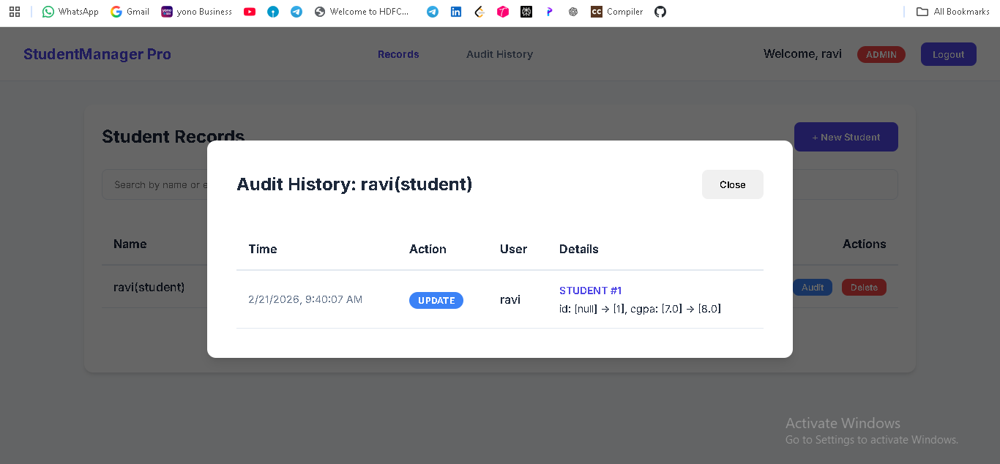

# Audit Pro: Student Management System

A production-grade Student Management System architectural showcase featuring a secure, layered backend and a premium, responsive frontend. Designed for audit readiness and operational excellence.


---

## 🏛️ Architecture Overview

The system follows a clean **Layered Architecture** pattern, ensuring separation of concerns and high maintainability.

- **Frontend**: A modern, single-page interface focusing on high-end aesthetics and user experience.
- **Backend API**: A Spring Boot RESTful API with versioned endpoints (`/api/v1`).
- **Data Layer**: Spring Data JPA with an emphasis on automated auditing and consistent data state.

## ✨ Key Features

### 🔐 Secure Identity Management
- **Stateless Authentication**: JWT-based session management with secure claim handling.
- **Granular RBAC**: Role-Based Access Control enforcing strict permissions for `ADMIN`, `STAFF`, and `STUDENT`.
- **Encryption**: BCrypt password hashing for industry-standard credential storage.

### 📋 Audit & Intelligence
- **Automated Auditing**: Native JPA auditing tracks `createdAt`, `updatedAt`, and `modifiedBy` for every record.
- **Centralized Logging**: Structured application logs via Logback integration.
- **Error Handling**: Standardized RFC 7807 problem details for API error responses.

### 🎨 Premium User Experience
- **Responsive Design**: Mobile-first approach with fluid layouts.
- **Interaction Design**: Micro-animations and smooth transitions for a delightful user experience.
- **Modern Stack**: Built with Inter Font and a curated, accessibility-focused color palette.

---

## 📸 Interface Preview

#### Admin Dashboard
The command center for administrators, providing a high-level overview of system metrics and management controls.


#### Audit Logs
Transparent visibility into system changes, ensuring accountability and audit readiness.


#### Staff & Student Views
Tailored interfaces for staff collaboration and student information management.


---

## 🛠️ Technology Stack

| Layer | Technologies |
| :--- | :--- |
| **Backend** | Java 17, Spring Boot 3.1, Spring Security, Data JPA, MapStruct, Jakarta Bean Validation |
| **Frontend** | Pure HTML5, CSS3, JavaScript (ES6+), Inter Typeface |
| **Database** | MySQL 8.0+ |
| **Docs** | OpenAPI 3.0 (Swagger UI) |

---

## 🚀 Getting Started

### Prerequisites
- JDK 17
- Maven 3.8+
- MySQL Server

### Quick Setup

1. **Database Configuration**
   Configure your connection in `src/main/resources/application.yml`:
   ```yaml
   spring:
     datasource:
       url: jdbc:mysql://localhost:3306/audit_student_db
       username: ${DB_USER}
       password: ${DB_PASS}
   ```

2. **Run Application**
   ```bash
   mvn clean install
   mvn spring-boot:run
   ```

3. **Explore API**
   Navigate to `http://localhost:8080/swagger-ui.html` to view the interactive API documentation.

---

## 📁 Core Directory Structure

```text
src/main/java/com/auditready/studentsystem/
├── config/       # System configurations (Security, JPA, OpenApi)
├── controller/   # Versioned REST Controllers
├── dto/          # Modern Java Records for data transfer
├── entity/       # Audit-aware JPA Entities
├── exception/    # Global Exception Handling Logic
├── mapper/       # MapStruct performance mappers
├── repository/   # Data Access Layer
├── security/     # JWT & Authentication Logic
└── service/      # Business Logic Layer
```

---
*Built for excellence.*