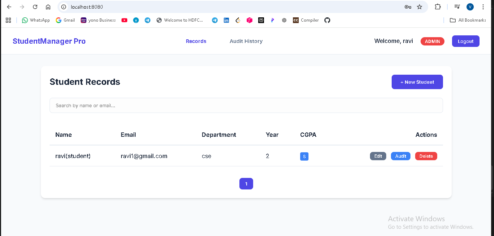
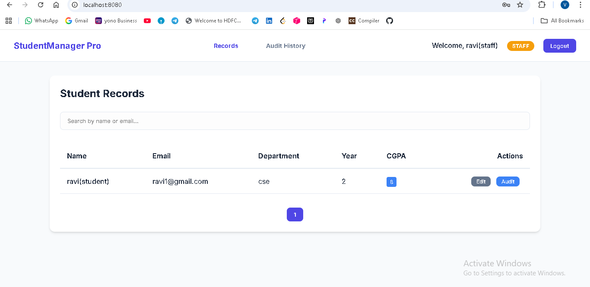
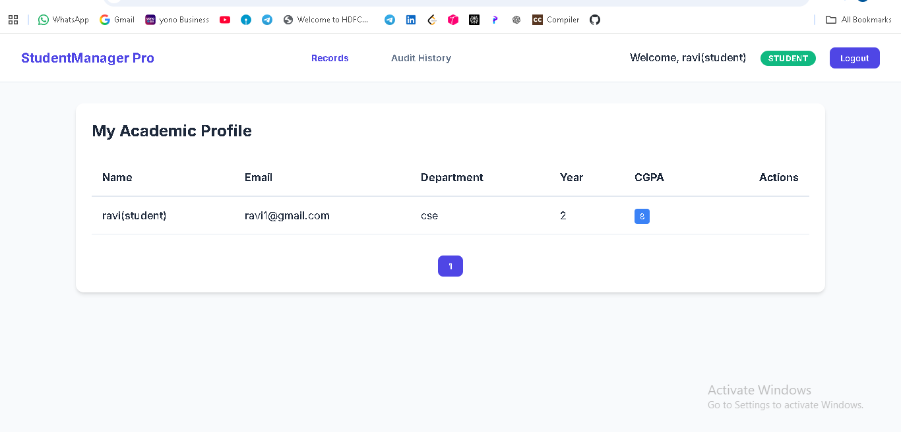

# Audit Pro: Advanced Student Management System

A production-grade, audit-ready Student Management System featuring a clean layered architecture, secure JWT authentication, and a modern, responsive frontend.


## 📸 Visual Overview

| Admin Dashboard | Staff View | Student Profile | Audit History |
| :---: | :---: | :---: | :---: |
|  |  |  |  |

## 🌟 Key Features

- **Professional UI**: Sleek, card-based dashboard with smooth transitions and micro-animations.
- **Audit-Ready Architecture**: 
  - Automated JPA Auditing (`createdAt`, `updatedAt`, `createdBy`).
  - Structured application logging (`logback-spring.xml` integration).
  - Centralized global exception handling.
- **Security First**: 
  - JWT-based stateless authentication.
  - BCrypt password encoding.
  - Role-based access control.
- **Modern Backend**:
  - Layered Architecture (Controller -> Service -> Repository).
  - DTO Pattern with Java Records.
  - MapStruct for high-performance entity mapping.
  - Validation using Jakarta Bean Validation.

## 🛠️ Technology Stack

- **Backend**: Java 17, Spring Boot 3.1, Spring Security, Spring Data JPA, Hibernate, MySQL.
- **Frontend**: Vanilla HTML5, CSS3 (Rich Aesthetics), JavaScript (ES6+), Inter Font.
- **Documentation**: Swagger UI / OpenAPI 3.0.

## 🚀 Getting Started

### Prerequisites
- Java 17+
- Maven
- MySQL

### Database Configuration
Update `src/main/resources/application.yml` with your database credentials:
```yaml
spring:
  datasource:
    url: jdbc:mysql://localhost:3306/audit_student_db
    username: your_username
    password: your_password
```

### Build & Run
```bash
mvn clean install
mvn spring-boot:run
```

## 📁 Project Structure

```
src/main/java/com/auditready/studentsystem/
├── config/       # Security, JPA, OpenApi Config
├── controller/   # Versioned REST Controllers (v1)
├── service/      # Service interfaces and implementations
├── repository/   # JPA Repositories
├── entity/       # Audit-aware JPA Entities
├── dto/          # Modern Java Records for Data Transfer
├── mapper/       # MapStruct Mapper Interfaces
├── exception/    # Custom Exceptions & Global Handler
└── security/     # JWT & UserDetails Logic
```

## 📖 API Documentation

Access the professional Swagger UI at:
`http://localhost:8080/swagger-ui.html`

## 🛡️ Audit Capabilities

Every record modification is tracked automatically. Check the `logs/` directory for structured system logs or view the audit fields in the database.

---
Built with ❤️ for Audit Readiness & Visual Excellence.